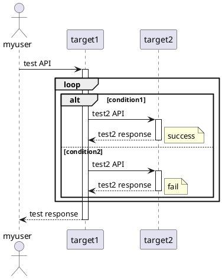

#シーケンス図

vscode拡張はplantuml syntaxとsimple viewerがいい感じ

サーバーをplantuml serverにする
ホスト名をhttps://www.plantuml.com/plantumlにする

docker入れてローカルもありかも

自分：actor `#色`
ターゲット：participant、database、collections、queueあたり



```plantuml

actor myuser
participant target
myuser->target: test
```